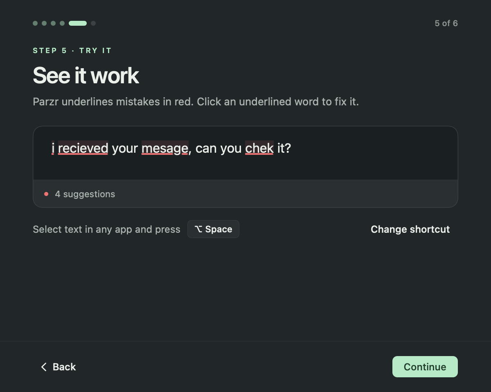
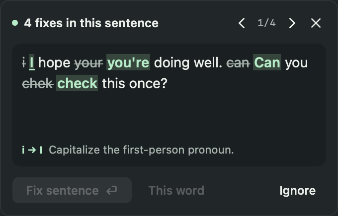

<p align="center">
  
</p>

<h1 align="center">Parzr</h1>

<p align="center">
  <b>Write like you meant it.</b><br>
  Grammar, spelling and tone help in every app on your Mac.<br>
  Offline. Open source. Free.
</p>

<p align="center">
  <a href="https://github.com/jn-aman/parzr/releases/latest"><b>Download for Mac</b></a> ·
  <a href="https://parzr.app">parzr.app</a> ·
  <a href="https://github.com/jn-aman/parzr/issues">Report a bug</a>
</p>

<p align="center">
  <a href="https://github.com/jn-aman/parzr/releases/latest"></a>
  
  
  
  <a href="LICENSE"></a>
</p>

<p align="center">
  
</p>

---

Parzr underlines mistakes as you write, in the apps you already use. Click the flagged word and the card shows the **whole corrected sentence**; press Return and every error in it is fixed. Select any passage and press **Option+Space** to check it, or rewrite it as Professional, Friendly, Concise or Direct.

Everything runs on your Mac. No account, no cloud, no telemetry, no extension. Your writing never leaves it; the app's only network request is a daily check for a new version, which you can turn off.

> **Public beta.** Signed and notarized by Apple. English coverage is growing and Parzr will not catch every error. Please [tell us what you find](https://github.com/jn-aman/parzr/issues).

## Highlights

<table>
<tr>
<td width="50%" valign="top">

**One keystroke fixes the sentence**<br>
The card leads with the corrected sentence: removed words struck through, fixes in mint. Return applies all of them.

</td>
<td width="50%" valign="top">

**Red for mistakes, blue for style**<br>
Solid, thick underlines you cannot miss, like the tools you know. Hover to highlight, click the word to fix it.

</td>
</tr>
<tr>
<td valign="top">

**Built to respect names**<br>
Parzr never respells a name, it gives it its capital: "aman jain" becomes "Aman Jain", "thanks, priya" becomes "thanks, Priya". Parzr learns names from your undo, your Ignore, the macOS dictionary and (opt-in) Contacts, and never learns a known misspelling like "teh" as one.

</td>
<td valign="top">

**No extension needed**<br>
Works through macOS Accessibility in Safari, Chrome, Brave, Edge, Arc, Firefox, Mail, Word and native apps. Google Docs works too, after a one-time switch in Docs. Option+Space covers the rest. [Optional extensions](#optional-extensions) add more for VS Code, Neovim and the browser.

</td>
</tr>
<tr>
<td valign="top">

**Smart grammar on the Neural Engine**<br>
Since 0.2. A small grammar model (GECToR) runs on your Mac's Neural Engine in about 2 ms per sentence and catches what rules cannot, like "will be release" (released) or "since three years" (for). Its fixes pass the same guards as everything else: names, links and code are left alone.

</td>
<td valign="top">

**Fast enough to disappear**<br>
From keystroke to underline in about 46 ms for a chat message and 83 ms for a 4 KB paragraph in a 64 KB document (median, pause included, on a busy Mac). It was 139 and 715 ms in 0.1.x.

</td>
</tr>
<tr>
<td valign="top">

**Five writing modes**<br>
Fix keeps your voice. Professional, Friendly, Concise and Direct rewrite deliberately, then grammar runs again. Every mode is labelled on the card, with a tooltip saying what it does, and a check that finds nothing says so for that mode instead of leaving a blank card.

</td>
<td valign="top">

**Private by construction**<br>
Writing stays in memory on your Mac. Both models ship inside the app; no model downloads at runtime and nothing is logged.

</td>
</tr>
</table>

<p align="center">
  
  &nbsp;
  
</p>

## Install

1. Download **Parzr-x.y.z.dmg** from the [latest release](https://github.com/jn-aman/parzr/releases/latest) (checksums in `SHA256SUMS`).
2. Drag **Parzr** to **Applications** and open it.
3. The welcome guide asks for **Accessibility** (required) and, if you like, **Contacts**. No restart needed.

Parzr updates itself from 0.3 on, so if you have 0.2.x, install 0.3 once by hand. From then on it checks GitHub once a day, downloads a new version quietly and installs it when you quit Parzr or after five idle minutes, with a 10 second countdown you can cancel. Turn either off in **Settings, General, Updates**; **Check for Updates** in the menu bar and About works any time.

Then just write. Underlines appear when you pause. Change the shortcut, pause Parzr, turn it off per app, hide it from the Dock, or quit it from Settings, General (Parzr still shows its menus and Dock icon while its window is open).

Smart grammar is on by default (Settings, Writing, "Smart grammar (on-device model)"). Once setup is finished Parzr prepares the model in the background for the Neural Engine, which takes a few seconds the first time, so it is ready before you need it.

## Works where you write

| Where | How | Status |
| --- | --- | --- |
| Safari, Chrome, Brave, Edge, Arc, Firefox | macOS Accessibility, no extension | Verified (Safari, Chrome, Brave, Firefox) |
| TextEdit, Mail, Word, Xcode comments | macOS Accessibility | TextEdit verified end to end; Mail and Word reads verified |
| Slack, Teams, Notion, Discord (Electron) | macOS Accessibility | Supported, not yet tested here |
| VS Code, Cursor (Markdown and text) | Opt-in setting | Unit-tested |
| Google Docs (Chrome, Edge, Brave, Arc) | Native underlines, card and fixes once Docs' screen reader and braille support are on (Tools, Accessibility); otherwise Option+Space copies, checks and pastes | Verified in Chrome |
| Other canvas editors | Option+Space copies, checks and pastes the fix | Supported |

Details and evidence: [integrations](docs/integrations.md).

### Optional extensions

Parzr needs no extension anywhere. Three optional adapters exist for the cases where Accessibility cannot do the job. All three run the local rules engine on your Mac (no Smart grammar, no network) and need Parzr installed in Applications.

| You want | Install | Steps |
| --- | --- | --- |
| Real squiggles, the Problems panel and quick fixes in VS Code or Cursor | `parzr-vscode-X.Y.Z.vsix` from the [latest release](https://github.com/jn-aman/parzr/releases/latest) | In VS Code: Extensions, "...", **Install from VSIX**, pick the file |
| Cards and fixes inside web editors that Accessibility cannot read or edit (Chrome, Edge, Brave, Chromium, Firefox 140+) | `parzr-browser-extension-X.Y.Z.zip` from the release, or the copy inside the app (Settings, Integrations, **Open integrations**) | Load it unpacked, then register it once with `connect-browser.py` |
| Neovim, Helix, Emacs, Zed or Sublime (editors Parzr cannot see) | Nothing to download | Point the editor's LSP client at `/Applications/Parzr.app/Contents/MacOS/parzr-lsp` |

Step by step instructions, what was tested and the from-source routes are in [integrations](docs/integrations.md#install-the-optional-extensions).

## How it works

<p align="center"></p>

- **As you type:** after a short pause (35 ms at the default setting, at once after a space or punctuation) Parzr reads the focused field through Accessibility, takes the paragraph you are in and sends it to a Rust engine (tokenizer, protected spans for links, code and names, phrase and context rules, verb morphology, frequency-ranked spelling, keyboard slips that land on a real word ("this os bad" to "this is bad", only when the words on both sides clearly agree), minimal UTF-16 edits that keep your formatting and Undo). Names come from your Contacts (opt-in), your document and the system spell checker. The rules answer first, in well under a millisecond for a chat message.
- **Smart grammar:** the engine then asks GECToR, a RoBERTa-base grammar tagger (method by Grammarly, Omelianchuk et al. 2020), about each sentence it has not seen before. The model tags words (keep, replace, append, verb form, plural) instead of rewriting, runs as Core ML int8 on the Apple Neural Engine in about 2 ms per sentence, uses about 18 MB of memory, stays loaded and is prewarmed in the background after launch. Answers are cached per sentence, so typing only pays for the sentence you are editing. Its edits pass Parzr's own guards: names, links and code are never touched, case is never changed, an unknown word is never respelled, code-mixed and Hinglish sentences are left alone, edits that belong together stand or fall together, and your choices (one or many, which article, "thanks for") are not second-guessed. A rule's edit always wins over the model's.
- **On demand:** explicit checks (Option+Space) and tone rewrites add the bundled Qwen3.5-0.8B (593 MB, offline, llama.cpp on Metal), followed by another grammar pass; a Fix check also runs Smart grammar, tones do not. Names and links are masked from the model, guards keep it to plausible corrections (no quote or dash straightening, no optional or date commas, no mid-sentence recasing, no respelling one known word as another), and a name judge stops it from respelling a name. The model loads when needed and is released after 30 seconds idle.
- **Private by construction:** the app, engine and both models make no network requests while checking text. The models ship inside the app; no model downloads at runtime. The app's only network request is a daily check for a new version (a plain request to GitHub for a small signed update file); it sends nothing about you or your writing, GitHub sees what any download shows (your IP address and the app version), and Settings can turn it off.
- See the [detailed diagrams](docs/architecture.md) of the typing path and the explicit path, and [grammar coverage](docs/grammar-coverage.md).

## Measured, in the open

Typing checks on public English benchmarks, with 0.1.x for comparison. "Rules only" is 0.2 with Smart grammar turned off; the last column is the default.

| | 0.1.x | 0.2, rules only | 0.2, Smart grammar (default) |
| --- | --- | --- | --- |
| BEA-2019 dev, F0.5 (precision / recall) | 0.202 (0.43 / 0.065) | 0.228 (0.63 / 0.06) | **0.529** (0.71 / 0.26) |
| CoNLL-2014, F0.5 (precision) | 0.212 (0.48) | 0.222 (0.57) | **0.550** (0.72) |
| JFLEG test, GLEU (F0.5) | 0.478 (0.533) | 0.479 (0.565) | **0.540** (0.690) |
| False alarms on clean published text, per 1,000 words | 9.34 | 1.07 | 3.39 (chat 0, Hinglish 0) |
| Names damaged: all / lowercase / held-out | 0.08% / 0.18% / 1.40% | 0.03% / 0.07% / 1.14% | 0.05% / 0.11% / 1.14% |
| Real typos still corrected | 94.4% | 95.4% | 95.4% |

**Reading the table.** Precision is the share of Parzr's suggestions that were right; recall is the share of the real mistakes it found. F0.5 combines the two and weighs precision twice as much as recall, the usual choice for grammar checkers because a wrong suggestion costs more than a missed one. GLEU scores how close a corrected sentence is to several human corrections (JFLEG, higher is better). The false-alarm row counts suggestions on 1,996 sentences of clean published text (Gutenberg, Wikipedia, chat, Indian English, Hinglish), so lower is better. Recall is still modest: on BEA-2019 dev Parzr finds about one error in four, and what it flags is right about seven times in ten. Smart grammar adds some false alarms over rules alone and stays well below 0.1.x.

The public corpora are used for evaluation only and are not in this repository.

Our own checks, authored for Parzr:

| Benchmark | Result |
| --- | --- |
| [Names](benchmarks/names/README.md): 6,426 sentences, 23 naming traditions | The names row above; CI runs it (rules only) |
| [English challenge](benchmarks/README.md): 3,000 authored paragraphs plus clean controls | Exact corrections on all, no clean text changed (rules path) |

The English challenge was authored for Parzr's rules, so it shows regressions rather than general accuracy.


*How Parzr decides what is a name, why it never respells one, and how the benchmark above is measured.*

<details>
<summary><b>Build from source</b></summary>

Requires an Apple Silicon Mac on macOS 13+, Xcode command-line tools with Swift 6+, Rust 1.91+, Python 3.11+ and Node 22 for the integration tests. Dependencies download at build time, including the converted GECToR model (the `gector-v1` GitHub pre-release, hash-checked by `scripts/prepare-model.py`; `scripts/convert-gector.py` rebuilds it); writing analysis always runs offline.

```sh
python3 scripts/build.py         # dist/Parzr.app (ad-hoc signed)
open dist/Parzr.app
python3 scripts/package.py       # optional: a local DMG
```

Run what CI runs:

```sh
python3 scripts/audit-public-repo.py
python3 scripts/check-release-version.py
cargo fmt --manifest-path engine/Cargo.toml --check
cargo clippy --locked --manifest-path engine/Cargo.toml --all-targets -- -D warnings
cargo test --locked --manifest-path engine/Cargo.toml
python3 scripts/prepare-model.py
cargo build --release --locked --manifest-path engine/Cargo.toml
export PARZR_MODEL_PATH="$PWD/dist/model/Qwen3.5-0.8B-Q5_K_M.gguf"
export PARZR_MODEL_RUNTIME="$PWD/dist/model/libparzr_model.dylib"
python3 scripts/run-name-benchmark.py          # add --gec to include Smart grammar
PARZR_ENGINE_PATH="$PWD/engine/target/release/libparzr_engine.dylib" swift test --package-path mac
npm ci && npx playwright install chromium
npm run test:editors && npm run test:browser
```

Interactive native QA opens only authored fixtures and needs a desktop session with Accessibility; see [QA evidence](docs/qa/README.md).

</details>

<details>
<summary><b>Releases</b></summary>

One click: **Actions → Release → Run workflow** (or `gh workflow run release.yml -f bump=patch`). CI bumps every version file, tags, builds, signs, notarizes, staples and publishes the DMG with checksums, the update feed that installed apps check, and the optional VS Code and browser extension files. See [releases](docs/releases.md).


</details>

## Contributing

Issues and pull requests are welcome. New rules should come with error and valid-context fixtures, provenance, intent preservation and editor safety checks; see [CONTRIBUTING.md](CONTRIBUTING.md) and [SECURITY.md](SECURITY.md).

Parzr's code is licensed under [Apache-2.0](LICENSE). The bundled GECToR weights are for non-commercial use only (see [THIRD_PARTY_NOTICES](THIRD_PARTY_NOTICES)); Parzr is free and non-commercial. Other third-party components are listed there too.
