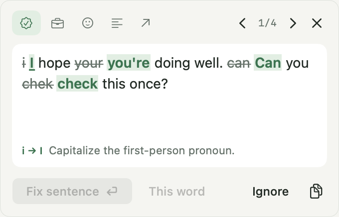

# Parzr

A native, offline macOS writing assistant. Automatic underlines lead to small inline correction popups; select text and use a configurable shortcut for passage checking. Grammar, spelling and punctuation run in every mode; Professional, Friendly, Concise and Direct add deliberate tone changes.

**Development beta.** A local app and DMG can be built now. Distribution signing/notarization requires a Developer ID certificate and notarization credentials. English coverage is growing; this project does not claim to detect every grammatical error or safely edit every application's custom document model.



Corrections stay beside your words in a compact 340 × 218 point card, with a corrected sentence preview and a Fix sentence action. The [writing space](docs/qa/screenshots/playground.png) includes visible writing modes and a suggestion review panel. The menu panel and inline cards follow Graphite, Paper or your Mac’s theme.

## Build and run

Requires an Apple Silicon Mac running macOS 13+, Xcode command-line tools with Swift 6+, Rust 1.91+, Python 3.11+, and Node 22 for integration tests. Dependency downloads occur at build time; writing analysis runs offline.

```sh
python3 scripts/build.py
open dist/Parzr.app
python3 scripts/package.py
```

The default local DMG is `dist/Parzr-0.1.0-local.dmg`, ad-hoc signed and not notarized. A local build made with `--sign` contains a Developer ID signed app; notarization is a separate release step. Drag the app to Applications and enable Accessibility. Select prose and press **Option+Space**. Record a different combination in **General → Check selected text**. Automatic suggestions are enabled by default after permission; click an inline mark to review a correction. Pause or disable them per app in Settings.

Parzr has its own Rust writing compiler: tokenization, protected spans, phrase/context rules, verb morphology, local clause analysis, frequency-ranked spelling, grammar → tone → grammar pipeline, minimal UTF-16 edit planning, and source maps. Apple NaturalLanguage contributes hints across the macOS adapters. Automatic grammar uses the fast engine without loading model weights. Explicit passage checks and styles use bundled Qwen3.5-0.8B Q5_K_M through llama.cpp/Metal, followed by another grammar pass. The 593 MB model, runtime and attributed frequency data ship inside the app and DMG; no runtime download, local HTTP server, account or telemetry.

## Integrations and verification

See [editor integrations and evidence](docs/integrations.md), [grammar coverage](docs/grammar-coverage.md), [grammar evidence catalog](docs/grammar-evidence.md), [architecture](docs/architecture.md), [release setup](docs/releases.md), and [QA evidence](docs/qa/README.md). Browser and VS Code adapters are included. Compatibility is capability-based; unverified hosts are labeled.

The [1,000-paragraph English challenge](benchmarks/README.md) measures actual corrections against authored references, with 100 clean controls and reproducible reports from both the packaged engine and native NLP path.

```sh
python3 scripts/audit-public-repo.py
python3 scripts/check-release-version.py
cargo fmt --manifest-path engine/Cargo.toml --check
cargo clippy --locked --manifest-path engine/Cargo.toml --all-targets -- -D warnings
cargo test --locked --manifest-path engine/Cargo.toml
python3 scripts/prepare-model.py
cargo build --release --locked --manifest-path engine/Cargo.toml
export PARZR_MODEL_PATH="$PWD/dist/model/Qwen3.5-0.8B-Q5_K_M.gguf"
export PARZR_MODEL_RUNTIME="$PWD/dist/model/libparzr_model.dylib"
PARZR_ENGINE_PATH="$PWD/engine/target/release/libparzr_engine.dylib" swift test --package-path mac
npm ci
npx playwright install chromium
npm run test:editors
npm run test:browser
```

Explicit native QA opens only authored fixtures. TextEdit testing exercises typing-driven highlights, a compact correction button, real AX replacement, formatting, paragraphs and Undo. UI testing exercises native controls and window restoration. These require an interactive macOS session; TextEdit testing also requires Accessibility:

```sh
dist/Parzr.app/Contents/MacOS/parzr --integration-test dist/native-qa
dist/Parzr.app/Contents/MacOS/parzr --typing-test dist/qa/typing
dist/Parzr.app/Contents/MacOS/parzr --grammar-typing-test dist/qa/grammar-typing
dist/Parzr.app/Contents/MacOS/parzr --paste-test dist/qa/paste
dist/Parzr.app/Contents/MacOS/parzr --ui-test dist/qa/ui-controls
```

## Open source and roadmap

Apache-2.0; see [LICENSE](LICENSE) and [THIRD_PARTY_NOTICES](THIRD_PARTY_NOTICES). Contributions should include error/valid-context fixtures, source provenance, intent preservation and editor safety checks. See [CONTRIBUTING.md](CONTRIBUTING.md).

The [Parzr.app website plan](docs/website-plan.md) targets Cloudflare after product acceptance. Release automation is implemented in `.github/workflows/ci-release.yml`; repository setup and secrets are still required before a real signed release can run.
