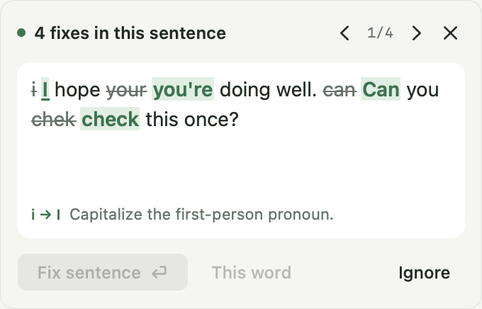

# Parzr

**A writing assistant that lives on your Mac. Offline. Open source. Free.**

Parzr underlines grammar, spelling and punctuation as you write, in the apps you already use. Click a flagged word to see the whole corrected sentence and fix it in one keystroke. Select a passage and press **Option+Space** to check it, or rewrite it as Professional, Friendly, Concise or Direct. Everything runs on your Mac: no account, no cloud, no telemetry.

[**Download the public beta**](https://github.com/jn-aman/parzr/releases/latest) · [parzr.app](https://parzr.app) · Apple Silicon · macOS 13 or later



> **Public beta.** Parzr v0.1 is signed and notarized by Apple. English coverage is growing, and Parzr will not catch every error or work in every app's custom editor. Please [report what you find](https://github.com/jn-aman/parzr/issues).

## Install

1. Download `Parzr-x.y.z.dmg` from the [latest release](https://github.com/jn-aman/parzr/releases/latest) and check it against `SHA256SUMS` if you like.
2. Open the DMG and drag **Parzr** to **Applications**, then open it from there.
3. Allow **Accessibility** when asked (System Settings, Privacy & Security, Accessibility). Parzr needs it to read and correct text in other apps; it cannot grant this to itself.

Then just write. Underlines appear when you pause. Click the word itself to open its fix; **Return** applies the whole sentence. Select text and press **Option+Space** for a full passage check or a tone rewrite. Change the shortcut, pause Parzr, or turn it off per app in Settings. Turn off **Show in Dock** to keep Parzr in the menu bar only.

## What it does

- **Fixes the whole sentence at once.** The card leads with the corrected sentence, removed words struck through and fixes in mint, so one keystroke repairs every error in it.
- **Five writing modes.** Fix keeps your voice. Professional, Friendly, Concise and Direct rewrite deliberately, then grammar runs again.
- **Works where you write, with no extension.** Parzr uses macOS Accessibility, so Safari, Chrome, Brave, Edge, Arc and Firefox, TextEdit, Mail and Word work natively; the browser extension, VS Code extension and language server are optional extras for developers. Verified by probes: TextEdit, Safari, Chrome, Brave and Firefox with default settings; Word and Mail reads. Slack, Teams and Notion are untested. VS Code and Cursor prose files are an opt-in setting. In canvas editors such as Google Docs, Option+Space copies your selection, checks it and pastes the fix. See [integrations](docs/integrations.md) for exactly what is verified.
- **Private by construction.** Writing stays in memory on your Mac. No account, telemetry, writing logs or HTTP server. The model ships inside the app; nothing downloads at runtime.

## How it works

Parzr has its own Rust writing engine: tokenization, protected spans (links, code, names, numbers), phrase and context rules, verb morphology, frequency-ranked spelling, and minimal UTF-16 edit planning that preserves your formatting and Undo. Apple NaturalLanguage contributes word hints.

Automatic checks use only this fast engine. Explicit passage checks and tone rewrites add the bundled **Qwen3.5-0.8B** model (Q5_K_M, 593 MB) through llama.cpp on Metal, followed by another grammar pass, and a guard keeps the model to plausible corrections. See [architecture](docs/architecture.md) and [grammar coverage](docs/grammar-coverage.md).

## Build from source

Requires an Apple Silicon Mac on macOS 13+, Xcode command-line tools with Swift 6+, Rust 1.91+, Python 3.11+, and Node 22 for the integration tests. Dependencies download at build time; writing analysis always runs offline.

```sh
python3 scripts/build.py         # builds dist/Parzr.app (ad-hoc signed)
open dist/Parzr.app
python3 scripts/package.py       # optional: a local DMG
```

Run the checks CI runs:

```sh
python3 scripts/audit-public-repo.py
python3 scripts/check-release-version.py
cargo fmt --manifest-path engine/Cargo.toml --check
cargo clippy --locked --manifest-path engine/Cargo.toml --all-targets -- -D warnings
cargo test --locked --manifest-path engine/Cargo.toml
python3 scripts/prepare-model.py
cargo build --release --locked --manifest-path engine/Cargo.toml
export PARZR_MODEL_PATH="$PWD/dist/model/Qwen3.5-0.8B-Q5_K_M.gguf"
export PARZR_MODEL_RUNTIME="$PWD/dist/model/libparzr_model.dylib"
PARZR_ENGINE_PATH="$PWD/engine/target/release/libparzr_engine.dylib" swift test --package-path mac
npm ci && npx playwright install chromium
npm run test:editors && npm run test:browser
```

Interactive native QA opens only authored fixtures and needs a desktop session with Accessibility; see [QA evidence](docs/qa/README.md). The [1,000-paragraph English challenge](benchmarks/README.md) measures corrections against authored references with clean controls.

## Releases

Releases are built, signed, notarized and published by CI. See [releases](docs/releases.md).

## Contributing

Apache-2.0; see [LICENSE](LICENSE) and [THIRD_PARTY_NOTICES](THIRD_PARTY_NOTICES). New rules should come with error and valid-context fixtures, provenance, intent preservation and editor safety checks. See [CONTRIBUTING.md](CONTRIBUTING.md).
