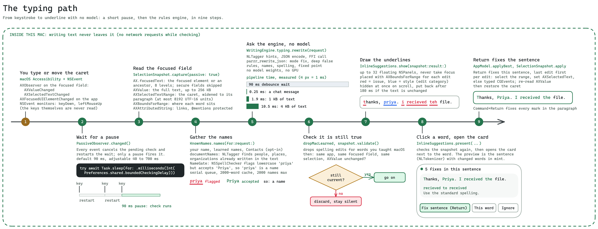
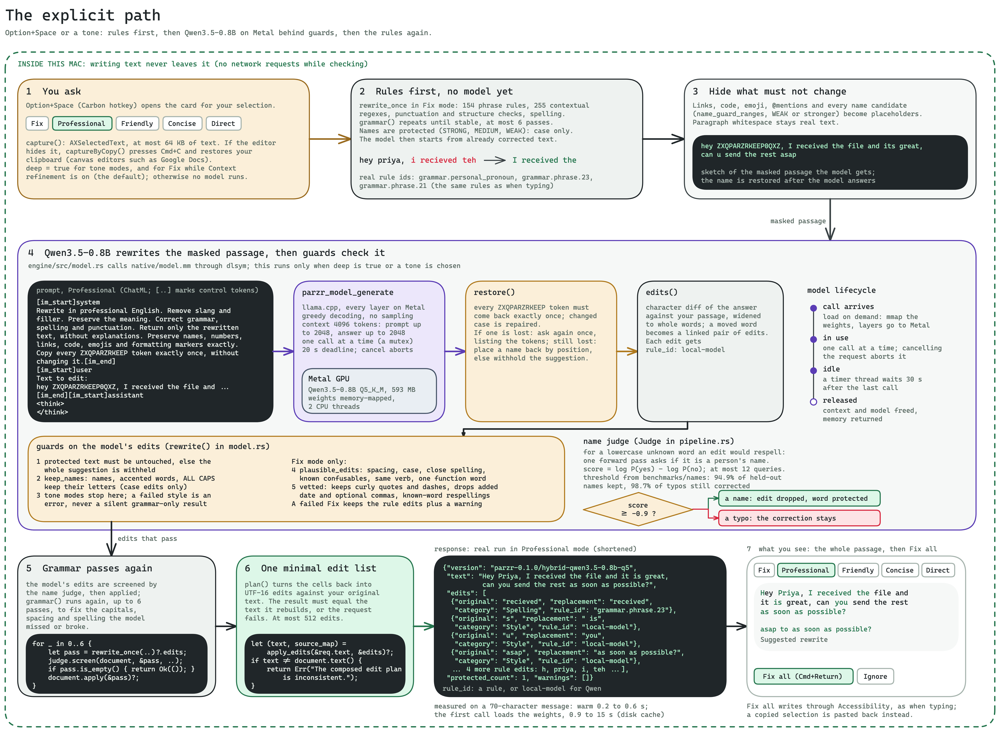

# Architecture

The Apple Silicon macOS app calls the bundled Rust library through bounded JSON FFI. Apple NaturalLanguage supplies token and entity hints: the app tags text itself, and the command-line engine, browser native host and LSP use the same macOS tagger through the native library. No adapter starts a network listener.

Three diagrams explain the system at three zoom levels, and the [Smart grammar](#smart-grammar-gector) section below covers the on-device grammar model they all show. Their editable sources are in [`docs/diagrams`](diagrams) (open them at excalidraw.com); every label uses a real function, file or attribute name from the code.

## Overview

How to read it, left to right:

1. **Where you write.** Safari, Mail, Chrome, Slack, Word, Firefox and any other app with an accessible text field. Parzr never reads secure fields, and skips Terminal, iTerm, Zed and JetBrains. VS Code and Cursor are checked only after you opt in.
2. **macOS Accessibility.** The only door into other apps. Parzr reads `AXValue`, `AXSelectedTextRange`, `AXBoundsForRange` and listens to `AXValueChanged`, `AXSelectedTextChanged` and `AXFocusedUIElementChanged`. To see inside some apps it sets `AXManualAccessibility` (Electron), falls back to `AXEnhancedUserInterface` (Chromium) or reads the application role (Firefox). Fixes are written back through the settable `AXSelectedText`, or typed as Unicode key events when an editor ignores that write (`AXCompat.swift`).
3. **Parzr.app, in Swift.** `PassiveObserver` and `Hotkey` start work. `SelectionSnapshot` and `AXCompat` read the field safely. `KnownNames` and `SystemLexicon` collect the names the engine must not touch. `WritingEngine` encodes the request and calls the engine. `AppModel` and `InlineSuggestions` validate the result, draw underlines and open the correction card.
4. **Rust engine.** Entry points are `parzr_rewrite_json`, `parzr_string_free`, `parzr_cancel_rewrite`, `parzr_gec_warm` (loads GECToR in the background) and `parzr_is_known_misspelling` (the app asks it before learning a name). The pipeline is a tokenizer, a name index (STRONG, MEDIUM, WEAK), 154 phrase rules in one Aho-Corasick automaton, 255 contextual regexes compiled only when a required-literal prefilter finds one of their literals, punctuation and structure checks, spelling (lexicon, deletion index, bigram ranking, and `real_word.rs`: keyboard-adjacent real-word slips judged by the word-pair counts on both sides, tuned on an authored set in `engine/tests/real_word.json` and BEA dev) and a fixed-point loop. Then `gec.rs` asks the GECToR grammar model about each sentence it has not seen and merges the model's edits that pass the guards. It returns minimal UTF-16 edits.
5. **Native runtime.** `libparzr_model.dylib` is loaded with `dlopen` and `dlsym`. It holds the NLTagger and NSSpellChecker helpers used by adapters that send no tokens, GECToR as a Core ML int8 model on the Apple Neural Engine (`parzr_gec_*`, always loaded once prepared, about 2 ms per sentence) and llama.cpp with Metal running Qwen3.5-0.8B Q5_K_M (593 MB). The Qwen weights load only on the explicit path.
6. **Optional adapters** (dashed, left). The VS Code extension spawns `parzr-engine` over stdio, the browser extension talks to `parzr-native-host` through native messaging, and other editors can run `parzr-lsp`. They reuse the same engine and model runtime, each in its own process. They do not set the `gec` request flag, so they get the rules (and Qwen where they ask for it), not Smart grammar. All three are optional; [integrations](integrations.md#install-the-optional-extensions) says when to want one and how to install it.
7. **Google Docs** (band under the optional adapters). Docs paints its page on a canvas, so the app reads its hidden "Document content" text area through the same Accessibility calls (screen reader and braille support on), places each word from the caret's screen point plus the word's offset in the hidden copy, and applies a fix by selecting the range once and typing the replacement, then re-reading to confirm. [integrations](integrations.md#google-docs-chrome-edge-brave-arc) has the setup.
8. **The wire** (strip below). A real request and response from `parzr-engine`, shortened. The response is the contract: `start_utf16` and `end_utf16` ranges into your original text, the `replacement`, a `category` that decides the underline colour (Style and Tone are blue, everything else red) and a `rule_id` that says who wrote the edit.

The dashed green border is the privacy boundary: the app, the engine and the model runtime make no network requests while checking text. The one request the app makes is the daily update check (Sparkle fetches `appcast.xml` from the latest GitHub release and verifies EdDSA signatures); it carries no writing and can be turned off in Settings. See [releases](releases.md). The bottom row of the diagram shows it: Sparkle in the app, a plain HTTPS GET of the feed about once a day, no system profile, and only an update whose EdDSA signature verifies is installed.

## The typing path

Automatic checking is a timeline of nine steps. Nothing on it loads Qwen; the only model it uses is GECToR, which is small, already resident and consulted once per new sentence.

1. **You type or move the caret.** `PassiveObserver` listens with an `AXObserver` on the focused field (`AXValueChanged`, `AXSelectedTextChanged`) and on the app (`AXFocusedUIElementChanged`), plus global `keyDown` and `leftMouseUp` monitors for editors that stay silent after a paste. A typed character is used only to tell whether the key ends a word; it is never stored.
2. **Pace the check.** `CheckPacer` decides when the check runs. A pause in typing waits 7/18 of the Checking delay setting, with a 20 ms floor, which is 35 ms at the default of 90 ms (the setting runs from 40 to 700 ms). Keys less than 80 ms apart wait the full setting instead. A space, Return, tab or punctuation key checks at once when the editor reports the change. One keystroke fires up to three triggers (key monitor, value change, selection change), and only the first one moves the timer.
3. **Read the focused field.** `SelectionSnapshot.capture(passive: true)` finds the focused element or one of its ancestors (up to eight levels, secure fields skipped; the secure verdict and the resolved field are remembered for 1.5 s or until focus moves), reads `AXValue` (up to 256 KB) and `AXSelectedTextRange`, widens the caret to its paragraph (at most 8192 UTF-16 units), asks for `AXBoundsForRange` and reads the attributed string so links and `@mentions` become protected ranges. It also asks once, here, whether the editor accepts a range patch, so the card never has to query the editor again to enable Apply.
4. **Gather the names.** `KnownNames.names(for:request:)` merges your own name, learned names and Contacts (opt-in) with `documentNames` (NLTagger people, places and organizations already in the text) and `NameGate`, which asks `NSSpellChecker`: if it flags `priya` but accepts `Priya`, the lowercase word is a name. `documentNames` is scanned per sentence and per line and remembered by hash, so typing rescans only what changed, and it runs side by side with the `NameGate` lookup (a serial queue with a 2000-word cache). The request carries at most 2000 names.
5. **Ask the engine: rules, then GECToR.** `WritingEngine.typing` adds NLTagger hints, encodes the request and calls `parzr_rewrite_json` with mode `fix`, `deep: false` and `gec: true` (the Smart grammar setting). The rules run first. Measured rules pipeline time is 0.25 ms for a chat message, 1.9 ms for 1 KB and 10.5 ms for 4 KB. Then `gec::combine` splits the text into sentences and runs GECToR on the ones it has not seen (at most 24 per typing request, about 2 ms each, answers cached), applies the guards and merges what survives into the rules' edits. Typing is incremental, so usually only the sentence you are editing is new, and the wait you notice is the pacing delay, not the engine. Measured end to end, from keystroke to marks on screen (median, pacing delay included, on a loaded machine), a chat message takes 46 ms, an email 47 ms and a 4 KB paragraph inside a 64 KB document 83 ms, down from 139, 161 and 715 ms.
6. **Check it is still true.** Spelling edits for words you taught macOS are dropped, then `snapshot.validate()` confirms the same app, the same focused field, the same selection and an unchanged `AXValue`. If anything moved, the result is discarded silently.
7. **Draw the underlines.** `InlineSuggestions.show` hands up to 32 underlines to `MarkOverlay`, which draws every mark as a `CALayer` in one transparent, click-through window per screen, placed with `AXBoundsForRange`, red for issues and blue for style. `MarkDiff` keeps the layers of marks that did not move, each underline is an accessibility button, and the window takes mouse events only while the pointer is on an underline. Marks hide at once on scroll and return after 180 ms if the text is unchanged.
8. **Click a word.** The snapshot is validated again and the card opens next to the word. Its hosting view is prewarmed at launch and reused, so a click only swaps the content. The preview is the sentence (split with `NLTokenizer`) with changed words in mint.
9. **Return fixes the sentence.** `AppModel.applyBest` applies the edits of that sentence from last to first. For each edit Parzr selects the range, sets `AXSelectedText` (or types the replacement with `CGEvent`), re-reads the text to verify, and finally restores the caret. Command+Return fixes every mark in the paragraph.

## The explicit path

Option+Space, or choosing Professional, Friendly, Concise or Direct, runs Qwen. Fix mode runs it too while **Context refinement** is on, which is the default. A Fix check also runs Smart grammar (GECToR) over every sentence of the passage; the tones do not.

1. **You ask.** `GlobalHotkey` opens the card for your selection. `SelectionSnapshot.capture()` reads `AXSelectedText` (up to 64 KB). If the editor hides it, `captureByCopy()` presses Command+C and restores your clipboard, which is how canvas editors work. Google Docs is read through Accessibility instead when its screen reader and braille support are on (see [integrations](integrations.md#google-docs-chrome-edge-brave-arc)); `captureByCopy()` is its fallback when they are off. The request sets `deep` for tone modes and for Fix while Context refinement is on.
2. **Rules first.** The same Fix-mode rules as when typing run to a fixed point (up to six passes) so the model starts from corrected text. Names stay protected and may only change case.
3. **Hide what must not change.** Links, code, emoji, `@mentions` and every name candidate (`name_guard_ranges`, WEAK or stronger) are replaced by `ZXQPARZRKEEP0QXZ`-style placeholders. Paragraph whitespace stays real text.
4. **Qwen on Metal.** The prompt is a ChatML message with one instruction per mode. `parzr_model_generate` decodes greedily with llama.cpp (context 4096 tokens, a 20 s deadline). `restore()` requires every placeholder to come back exactly once, asks again once with the tokens listed if one is lost, and withholds the suggestion if that fails. `edits()` diffs the answer against your passage into edits with `rule_id` `local-model`.
5. **Guards.** Protected text must be untouched. `keep_names` keeps names, accented words and ALL CAPS words letter for letter. In Fix mode `plausible_edits` keeps only corrections (spacing, case, close spelling, known confusables, the same verb, one function word). `vetted` then drops edits that only straighten curly quotes, delete quote marks, apostrophes, dashes or ellipses, or add a comma the rules call optional or wrong (inside a date, before "too" or "that", after a short prepositional opener, or before a conjunction that joins no two clauses). It also drops recasing other than at a sentence start, of an ALL-CAPS word or of "I", and the respelling of one known word as a similar known word, and it restores your curly quotes inside the edits it keeps. A failed Fix keeps the rule edits and adds a warning, while a failed tone is an error, never a silent grammar-only result. Beside the guards, the **name judge** asks the model one yes or no question (`parzr_model_name_log_odds`) about a lowercase unknown word that an edit would respell. At `log P(yes) - log P(no) >= -0.9` the word is kept as a name, with at most 12 questions per request.
6. **Grammar passes again, then one edit list.** The judge screens the model's edits, they are applied, the rule passes run again, and `plan()` rebuilds minimal UTF-16 edits against your original. The rebuilt text must equal the composed text or the request fails. In Fix mode with Smart grammar on, GECToR then runs over the original passage (up to 512 uncached sentences, where typing allows 24) and its guarded edits are merged into that plan.
7. **The card.** It shows the whole corrected passage with changed words in mint. Command+Return (Fix all) applies every chosen edit through Accessibility, as when typing; a copied selection is pasted back instead.

**Model lifecycle (Qwen).** The weights are memory-mapped and loaded on the first call that needs them. One call runs at a time, cancelling the request aborts it, and a timer thread releases the context and model 30 seconds after the last call, or three minutes after the last typing check that scored sentence swaps (below). Under memory pressure an idle model is released at once. On a 70-character message a warm call took 0.2 to 0.6 s on a busy machine; the first call also pays for loading the weights.

## Smart grammar (GECToR)

Rules are precise but narrow. Since 0.2 a small grammar model covers some of what they cannot: the wrong preposition, a verb form that needs its neighbour ("will be release"), a missing "to". It is **GECToR** (Grammarly's "Tag, Not Rewrite", Omelianchuk et al., BEA 2020), a RoBERTa-base encoder with two linear heads, using the checkpoint `gotutiyan/gector-roberta-base-5k` converted to Core ML. It is on by default (**Smart grammar (on-device model)** in Settings, Writing) and runs only in Fix mode.

**What it does.** Instead of writing a new sentence, it labels each word with one of 5,001 edit tags: keep, delete, replace with a word, append a word, change the verb form, make it plural or singular, change case, merge or split. Parzr applies the tags, repeats up to five rounds, and diffs the result against your sentence to get small edits. Because the output is a tag per word, the edits are minimal and never reorder or paraphrase. Their `rule_id` is `gector.append`, `gector.replace`, `gector.agreement` and so on, so they show up in the same card as rule edits.

**Where it lives.**

- `engine/src/gec_text.rs`: a tokenizer that follows spaCy's English rules (exported to `engine/rules/gec-tokenizer.json`) and the byte-level BPE of roberta-base.
- `engine/src/gec.rs`: sentence splitting, tag decoding (a 0.3 bonus for `$KEEP`, no tag below 0.7 probability), the held-back tags, detokenizing, the token diff, the cache, the guards and the merge.
- `native/model.mm`, `parzr_gec_prepare`, `parzr_gec_forward`, `parzr_gec_release`: the Core ML runtime. One static input of 80 subwords (`input_ids`, padded), two outputs (`logits_labels`, `logits_d`), compute units `CPUAndNeuralEngine` because letting Core ML pick the GPU is slower here. Sentences that need more than 80 subwords are cut at 80 and sentences over 4,000 bytes are left to the rules.
- `parzr_gec_warm` (`WritingEngine.warmGrammar`): called from the app in the background, at utility priority, a few seconds after setup is finished and Smart grammar is on. The first run compiles the model for the Neural Engine, which takes seconds; later runs reload in well under a second.

**Cost.** About 2 ms per sentence on the Neural Engine and about 18 MB of memory in Parzr, int8 weights. The model stays loaded; Parzr drops it only when macOS reports memory pressure, and reloads it on the next check. Without its files or the native runtime, `gec::combine` returns the rules' edits unchanged.

**Cache.** Answers are cached by sentence text (1,024 sentences, oldest dropped first). The cache holds the model's raw edits relative to the sentence, and the guards run again each time against the live text, names and rules. A typing request runs at most 24 uncached sentences and the rest wait for the next check; an explicit Fix check runs up to 512.

**Guards.** A model edit is dropped when any of these holds. It never overrides a rule or the writer.

- It overlaps an edit the rules made, a protected range (links, code, mentions) or a name guard range (see Names below).
- It changes only the case of a word that is not at the start of a sentence, or touches a capitalized word in the middle of a sentence.
- It rewrites the letters of a lowercase word the dictionary does not know, or of a lowercase word that is also a bundled given name (no respelling unknown words or possible names).
- It writes a word that is neither known nor already in the text (no made-up words from glued or split words).
- Its sentence has two or more lowercase words that neither the rules nor the dictionary know: that reads as code-mixed or non-English text (Hinglish, jargon), and the model is not trusted there.
- It is one of the writer's choices: one or many ("the museum event" to "events"), the part of speech after a determiner ("the build" to "the building"), which article ("the" for "a"), or the "for" after "thanks".
- It pairs with a dropped edit. When a plural is held back, the auxiliary verbs right after it ("is", "are", "has") stay as written. GECToR tags that lean on a held-back tag (verb form and agreement tags within two words) are held too.
- The model is not sure: it needs a detection score of 0.3 at the word, 0.83 to swap one word for another and 0.82 to add a comma.
- Two edits would begin at the same offset, or the merged plan would not apply cleanly to the original text. Then the rules' plan is returned as it was.

**Weights and licence.** The converted model ships in the app at `Model/gector` (`gector.mlmodelc`, vocabularies, label list and a manifest of SHA-256 hashes). `scripts/convert-gector.py` rebuilds it from the pinned Hugging Face revision for both fp16 and int8; `scripts/prepare-model.py` downloads the int8 zip from the `gector-v1` GitHub pre-release at build time and refuses it if the hash differs, and the app downloads no model (its only network request is the update check described above). Measured against the original fp32 weights, int8 keeps about 93% of the tags identical (fp16 about 98.7%). The checkpoint's model card says "Only non-commercial purposes". Parzr is free and non-commercial and uses it only on that basis; the code is Apache-2.0 and the weights are not. Anyone who redistributes or sells a build must check the condition for themselves. Credits, revisions and licences are in [THIRD_PARTY_NOTICES](../THIRD_PARTY_NOTICES).

**Measured.** On BEA-2019 dev the typing path scores F0.5 0.529 with Smart grammar against 0.228 with the rules alone and 0.202 in 0.1.x; false alarms on clean published text are 3.39 per 1,000 words against 1.07 and 9.34. The full table, with CoNLL-2014 and JFLEG, is in [model evaluation](model-evaluation.md).

## Guarantees and limits

Automatic typing runs grammar, spelling and punctuation to a bounded fixed point, retaining UTF-16 coordinates and original character anchors, and then adds the guarded edits of the GECToR grammar model. Explicit deep passage checks and all writing styles then use bundled Qwen3.5-0.8B Q5_K_M through llama.cpp/Metal. Another grammar pass follows model output. The composed edit plan must reproduce the returned text exactly.

Protected names, links, code, emoji and editor entities are masked during model inference, restored exactly and checked against the final edits. Paragraph whitespace remains in context. Unsafe contextual Fix output is withheld while safe grammar edits remain available with a warning. A failed style does not silently become a grammar-only style result. Selection boundary metadata prevents new terminal punctuation where the passage continues outside the selection.

The 593 MB Qwen model, the GECToR Core ML model, the native runtime, dictionary and reviewed rule/frequency assets ship in the app and DMG with licenses, pinned revisions and hashes. Metal uses one serialized model/context per process, bounded context, two CPU threads and memory-mapped weights. Idle Qwen state unloads after 30 seconds (three minutes while typing checks use it for sentence swaps). Automatic checks never wait for Qwen: with Smart grammar on they score sentence swaps only when it is loaded and free, and otherwise start loading it in the background; GECToR stays resident. Separate native app/editor processes can each load a context; memory use is not a single allocation shared by every integration.

Native accessibility snapshots resolve the focused text ancestry, exclude secure fields, bind source text to a host process, and validate focus, selection and source before range patching. Inline overlays use host bounds. Supported Electron hosts receive the documented accessibility activation attribute, Chromium browsers fall back to `AXEnhancedUserInterface`, and Firefox starts its accessibility engine when the application role is read. No unrelated document traversal or automatic acceptance is used.

Browser snapshots normalize text nodes, paragraph and BR boundaries, map UTF-16 positions back to DOM ranges, and protect mentions, links and readonly islands. Automatic marks are external overlays; input geometry uses a temporary hidden mirror. Checks follow the focused paragraph, defer during IME composition, invalidate changed drafts, and honor host edit refusals. Accessible frames share a bounded native-host queue. The extension is activated per page, with no blanket host permissions.

VS Code automatic diagnostics and inline fixes bind edits to document versions. Linked corrections apply as one transaction with Undo stops. Only local prose receives automatic diagnostics. Other editors can use the bundled UTF-16, versioned stdio LSP. Host adapters own formatting, Undo and version checks; unavailable capabilities retain Copy as a fallback.

Tests establish authored grammar cases, valid counterexamples, exact edit reconstruction, Unicode, protected structures and editor behavior. Protocol/DOM harnesses and actual installed-app acceptance are distinct evidence. Compatibility and quality claims follow those results, rather than assuming that a shared engine proves every English construction or editor.

## Names

A name candidate may only change case. `NameIndex::mark` in `engine/src/names.rs` gives every token a level. STRONG comes from the request's `names` and `dictionary`, the same word capitalized elsewhere in the text, an email local part, or a name hint from the macOS tagger. MEDIUM is a bundled name that is not an ordinary word or a known typo. WEAK is context alone: a greeting with a comma, a title, a sign-off, "looping in", a name list or a surname particle (`spelling::lowercase_name`). The tagger hint also covers lowercase names: `parzr_model_token_hints` in `native/model.mm` marks a word as a name when NSSpellChecker rejects it in lowercase but accepts it Capitalized, and the tokenizer drops that hint when the word is a known typo.

In `engine/src/lib.rs`, MEDIUM and stronger names become guard spans (neighbours such as "aman jain" merge into one), and any edit that overlaps a span must be case-only or it is dropped. WEAK names are never respelled, and WEAK and stronger names are masked from the local model. `never_a_name` overrides every signal for known misspellings, days, months, chat shorthand and one or two lowercase letters, so "Teh" still becomes "the". Hinglish words and surname particles (van, der, de) are never capitalized.

A lowercase name that reaches MEDIUM, or a WEAK word the lexicon lists only as a name ("mumbai"), gets a blue `names.capitalize` suggestion when the Name capitalization preference allows it. Names come from your own name, learned names, Contacts (opt-in) and the document, and Parzr learns more from an undone fix (the original word comes back at the same spot within a minute: 1), an Ignore (2) and repetition (3 sightings over 2 or more app and day pairs). A word on the reviewed misspelling list (`teh`, `recieved`, `alot`) is never learned by any route, and is never treated as a name if a request sends it as one (`is_known_misspelling`, which the app reaches through `parzr_is_known_misspelling`); each launch also purges any such word an older version had learned. The benchmark in [benchmarks/names](../benchmarks/names/README.md) checks on every pull request and release that names are not damaged: 0.05% overall, 0.11% in lowercase and 1.14% for held-out names with Smart grammar on (0.03%, 0.07% and 1.14% with the rules alone), with 95.4% of real typos still corrected.
